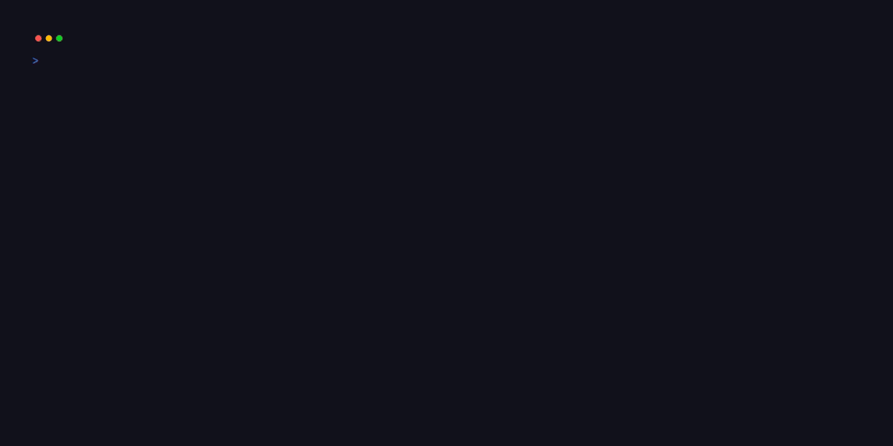

<div align="center">

# Seshagy



_The agent-aware terminal dashboard for modern developer workflows._

</div>

Navigating the terminal shouldn't break your flow, and managing AI coding agents shouldn't require playing hide-and-seek with your panes.

`seshagy` is a lightning-fast dashboard that bridges the gap between your project directories, active multiplexer sessions, and terminal-based coding agents. It gives you a bird's-eye view of your entire workspace, letting you jump exactly where you need to be with a single keystroke.

## ✨ Why use seshagy?

- **Navigate at the speed of thought:** Stop typing `cd` and `tmux attach`. Instantly jump to existing sessions or spin up new ones from your most used directories (powered by `zoxide` and `fd`).
- **Never lose track of your AI agents:** Running Pi, Claude Code, Codex, or Opencode in the background? `seshagy` automatically tracks their states across all panes. Instantly see if an agent is _working_, _blocked_ (needs your input), _done_, or _idle_ — without hunting for windows.
- **Zero friction, zero clutter:** Designed to be invisible until you need it. Pop it open with a keybind, find your destination, and hit enter. The dashboard instantly vanishes.
- **Universal multiplexer support:** Native, auto-detecting support for both **tmux** and **herdr**. It just works.

## 🚀 Quick Start

### 1. Install

**Homebrew:**

```sh
brew tap lmilojevicc/tap && brew install seshagy
```

**Go:**

```sh
go install github.com/lmilojevicc/seshagy/cmd/seshagy@latest
```

### 2. The Recommended Setup (Day-to-Day Use)

For the best experience, `seshagy` is meant to be a one-keystroke pop-up that gets out of your way as soon as you jump to a session.

We highly recommend installing the keybind via `seshagy install keybind` for day-to-day use. This wires up an ephemeral overlay (or popup window) to your multiplexer that auto-dismisses when you make a selection:

```sh
seshagy install keybind
```

_(Note: You can also run `seshagy keybind install tmux` or `seshagy keybind install herdr` if you need to specify your multiplexer or custom keys manually)._

### 3. Basic Usage

Open the dashboard anytime by running `seshagy` (or pressing your new keybind!).

- Press `z` or `f` to browse project directories from `zoxide` or `fd`.
- Press `enter` on a directory to create or switch to a session/workspace for it.
- Press `a` (all) / `t` (sessions) / `z` (zoxide) / `f` (fd) to filter sources.
- Press `h` to open the agent integration install menu.

---

## 🤖 Agent Tracking

`seshagy` acts as a mission control for your terminal AI tools. It knows when your agents need attention and when they are busy crunching tokens.

Supported agents include: **Pi, OpenCode, Claude Code, Codex, Cursor Agent, Antigravity, Grok Build, Cline, Devin**, and more.

### State Indicators

| State          | Meaning                                                  |
| -------------- | -------------------------------------------------------- |
| 🟢 **working** | Agent is actively generating code or running commands.   |
| 🔴 **blocked** | Agent is asking for permission or user input. Needs you! |
| 🔵 **done**    | Agent finished a turn but you haven't checked on it yet. |
| ⚪ **idle**    | Agent is sleeping or waiting for a prompt.               |

_How does it work?_ `seshagy` supports both `tmux` and `herdr` backends with different behaviors:

- Under **tmux**, it runs its own custom herdr-like detection.
- Under **herdr**, it defers completely to the native agent detection provided directly by herdr.

---

## ⌨️ TUI Keybindings

| Key                | Action                                        |
| ------------------ | --------------------------------------------- |
| `enter`            | Jump to session/directory or focus agent pane |
| `j`/`k`, `↓`/`↑`   | Navigate list                                 |
| `a`, `t`, `z`, `f` | Filter by: All / Sessions / Zoxide / fd       |
| `o`                | Toggle agent scope (current session vs all)   |
| `/`                | Filter list by typing                         |
| `R`                | Rename selected session                       |
| `x`                | Kill selected session or pane                 |
| `h`                | Open agent integration install menu           |
| `p`                | Toggle preview pane                           |
| `q` / `esc`        | Quit                                          |

---

## ⚙️ Requirements & Integrations

- **Multiplexer:** [tmux](https://github.com/tmux/tmux) or [herdr](https://herdr.dev). seshagy auto-detects your environment!
- **Optional (but highly recommended):**
  - `zoxide` (for frecency-ranked directory history)
  - `fd` (for blazing-fast directory discovery)
  - `yazi` (for interactive directory picking)
  - `eza` (for richer previews)

---

## 🛠 Configuration & Customization

seshagy is highly customizable to match your workflow and aesthetic.

Configuration lives in `~/.config/seshagy/config.toml` (or your `$XDG_CONFIG_HOME`). Initialize the default config file with:

```sh
seshagy config init
```

From there, you can:

- Customize theme colors and icons to match your terminal rice.
- Theme each pane independently — list, metadata, and preview borders and titles are configurable under `[theme.colors]` (see `docs/configuration.md`).
- Tweak `fd` commands.
- Enable `type_first` mode to instantly filter lists by typing without prefix keys.
- Toggle TUI styles (popup vs. cmdline) and layout order.

---

## 📖 Deep Dive & CLI

While the TUI is the main interface, seshagy provides a rich set of CLI commands for scripting, fzf-style menus, and agent integrations.

<details>
<summary>Click to view CLI commands and advanced usage</summary>

```sh
# Fetch raw data
seshagy --get-all --json
seshagy --get-sessions
seshagy --get-agents
seshagy --get-zoxide

# Agent integration internals
seshagy integration install pi
seshagy integration uninstall claude

# Manual multiplexer wiring
# herdr modes: pane (default) | popup (herdr 0.7.4+)
seshagy keybind install herdr --key f
seshagy keybind install herdr --mode popup --width 80% --height 80%
seshagy keybind install herdr --mode popup --persistent
# tmux:
seshagy keybind install tmux --mode popup
seshagy keybind install tmux --mode pane-zoomed --persistent
```

By default, installed keybinds launch `seshagy --ephemeral` and auto-dismiss on
focus loss. Pass `--persistent` when installing either a tmux or herdr keybind
to launch `seshagy` without focus-loss auto-dismiss; it stays open until you
explicitly quit with `q`.

Herdr popup `--width` and `--height` accept either terminal cell counts (for
example, `120`) or percentages (for example, `80%`) and both default to `80%`.
After installation, you can also edit `width`/`height` in the `[[keys.command]]`
binding in `~/.config/herdr/config.toml`.

### Multiplexer Vocabulary

seshagy speaks your multiplexer's language seamlessly:

| Concept  | tmux    | herdr     |
| -------- | ------- | --------- |
| Project  | Session | Workspace |
| Layout   | Window  | Tab       |
| Terminal | Pane    | Pane      |

</details>

## 🛠 Development

- `mise run verify` runs the CI gate (fmt, lint, test, build).
- `make build` produces a local `./seshagy` binary.

---

_Built for developers who value their time and terminal._
